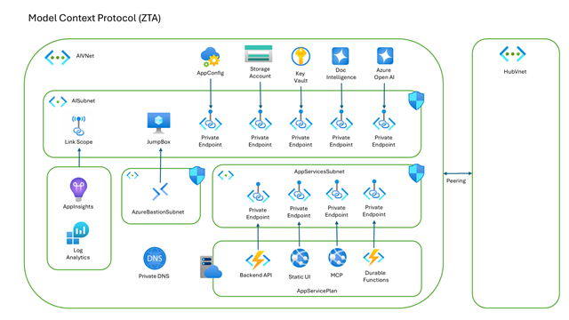

# GPT RAG Semantic Kernel Model Context Protocol Server

Welcome to the GPT-RAG Model Context Protocol (MCP) Server for the GPT-RAG series of repos. Note these currently point at the `givenscj` fork due to some reorganizing of the repos. The original repos are available in the `azure` organization, but will not currenlty work with the MCP server.

- [GPT-RAG](https://github.com/givenscj/gpt-rag) - [Use the cjg-app-configuration]
- [GPT-RAG-AGENTIC](https://github.com/givenscj/gpt-rag-agentic)
- [GPT-RAG-ORCHESTATOR](https://github.com/givenscj/gpt-rag-orchestrator)
- [GPT-RAG-FRONTEND](https://github.com/givenscj/gpt-rag-frontend)
- [GPT-RAG-UI](https://github.com/givenscj/gpt-rag-ui)
- [GPT-RAG-INGESTION](https://github.com/givenscj/gpt-rag-ingestion)

This code enables the exposing of tools, prompts and resources to the [GPT-RAG-AGENITC](https://github.com/givenscj/gpt-rag-agentic) orchestrator and can be deployed as a Web App, ACA Container or AKS deployment.

## Pre-requistes

- Visual Studio Code
- Azure CLI
- Azure Developer CLI (1.14.100 or lower)
- Git
- Docker/Docker Desktop (for container builds/deployment)

## Currently Available Tools

We have started with a common set of tools that we use for the [GPT-RAG-AGENITC](https://github.com/givenscj/gpt-rag-agentic) strategies, but also added some extras to make things interesting!

- Azure AI Search
- Azure Blob Storage
- Code Interpreter (ACA Session Pools)
- Cosmos
- Document Intelligence
- Remote MCP Servers (such as custom Rest APIs exposed by APIM)
- NL2SQL

## Future Tools

- Databricks
- Fabric
- Office Documents (Excel/Word/PowerPoint)
- Rest APIs
- SharePoint

## Documentation

- Features
  - [Dynamic Tool Loading](/docs/features/dynamic_tool_loading.md)
- Samples
  - [Custom Tool](/docs/samples/custom_tool.md)
  - [Function Triggers](/docs/samples/function_trigger.md)

## Architecture

Zero Trust (ZTA)



Model Context Protocol (MCP) Server

 Server")

Model Context Protocol (MCP) Flow

 Flow")

## Testing

- Clone the repo to `c:\github\azure`
- Run the following PowerShell to start the MCP Inspector server locally

```Powershell
npx @modelcontextprotocol/inspector uv --directory c:/github/azure/gpt-rag-mcp run server.py
```

- Create a new virtual environment and install the requirements

```python
python venv .venv
./.venv/scripts/activate.ps1
python -m pip install -r requirements.txt
```

- Using Visual Studio, use the `Run MCP Server` debug option to start the server

## Configuration

Tools are dynamically loaded using Python runtime instantiation techniques.  The agents and tools that are loaded are driven by the `tool_config.json` file. NOTE: This will be moved to cosmos in the future.

## Deployment

By default, GPT-RAG-MCP expects a landing zone to be in place for deployment.  This landing zone is driven by the GPT-RAG repo's bicep files.  Once you have deployed the landing zone using the `AZURE_USE_MCP=true` as an AZD ENV Variable, you will have the necessary resource to perform the following:

- Open a Visual Studio Code terminal
- Run the following:

```powershell
azd deploy mcpServer
```

The code will be packaged and deployed to the App Service with the tag `azd-service-name:mcpServer`

From there, you can interact with the MCP server over `SSE` via the `https://webappname.azurewebsites.net/sse` endpoint using the MCP inspector you have running from the commands above.

## Container Images (Preview)

We will be publishing a set of container images that represent the `golden` images based on the repo releases. You will be able to directly pull from these public container registries for fast deployment

## Full manual deployment steps

Run the following commands to provision and deploy the MCP server:

### Clone the GPT-RAG repo

```PowerShell
mkdir c:\temp
cd c:\temp
git clone https://github.com/givenscj/GPT-RAG
cd GPT-RAG
```

### Provision the resources

- You will need to set the following variables:

```text
azd env set AZURE_USE_MCP true
```

- If you want to deploy the ACA or AKS versions as containers, you will need to set one of the following:

```text
azd env set AZURE_USE_ACA true
```

OR

```text
azd env set AZURE_USE_AKS true
```

- And run azd provision:

```PowerShell
azd provision
```

### Deploy the MCP Server

```PowerShell
azd deploy mcpServer
```

### Deploy the Orchestrator

```PowerShell
azd deploy orchestrator
```

### Deploy the FrontEnd/UI

```PowerShell
azd deploy frontend
```

### Set the App Configuration Variables

- Browse to the Azure Portal and your resource group
- Select the App Configuration resource
- Set the basic MCP variables:

```python
AZURE_MCP_SERVER_URL=
AZURE_MCP_SERVER_TIMEOUT=
AZURE_MCP_SERVER_APIKEY=
AUTOGEN_ORCHESTRATION_STRATEGY=mcp
```

- Set the following variables to enable code interpreter:

```python
USE_CODE_INTERPRETER=true
POOL_MANAGEMENT_ENDPOINT=<URL_TO_SESSION>
```

### Agentic Prompt Example

You can change the Agentic Prompt to guide the agent in its execution of the tools available from the MCP Server.

The prompt currently lives in the the GPT-RAG-AGENTIC code base (soon it will be moved to Cosmos).

A sample prompt for processing a set of documents in a bronze container with document intelligence, then applied an LLM pass to create a JSON document based on a specific schema, then saving to a silver container would look like the following:

```text
You are document processing orchestrator. Using the tools available to you, retrieve documents and process them. 

The processing task steps are: 
	1) Retrieve documents with sas urls from the bronze container using the 'cjg_process_document_bronze' tool.
	2) Pass the retrieved document urls to the 'docInt_process_document_url' tool for processing.
	3) Execute the 'docInt_process_document_text' tool, ensure the schema fields are .
	4) Execute the 'save_document_json' to save the json result as the filename with '.json' appended.
	4) Return the unmodified response from the 'docInt_process_document_text' in the "answer" field.
	5) Summarized your reasoning and put in the "reasoning" field.
	
Using the task steps defined, start with the bronze container and process all files returned.
```
